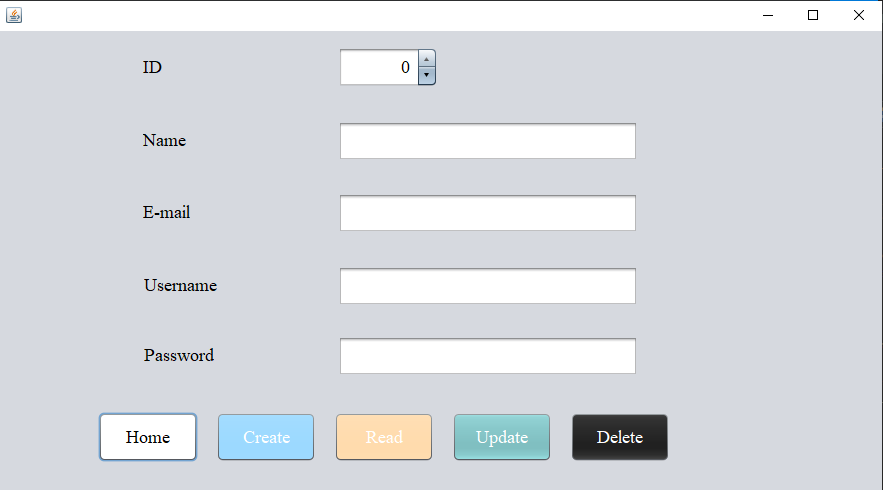
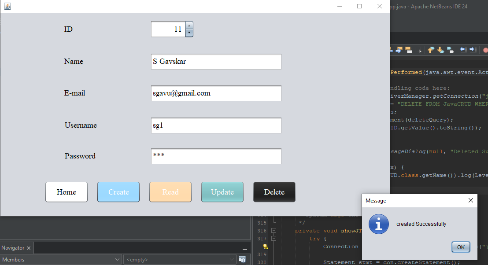
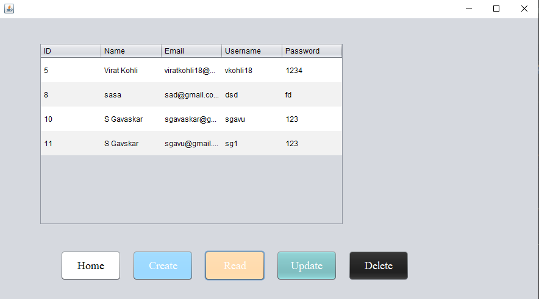
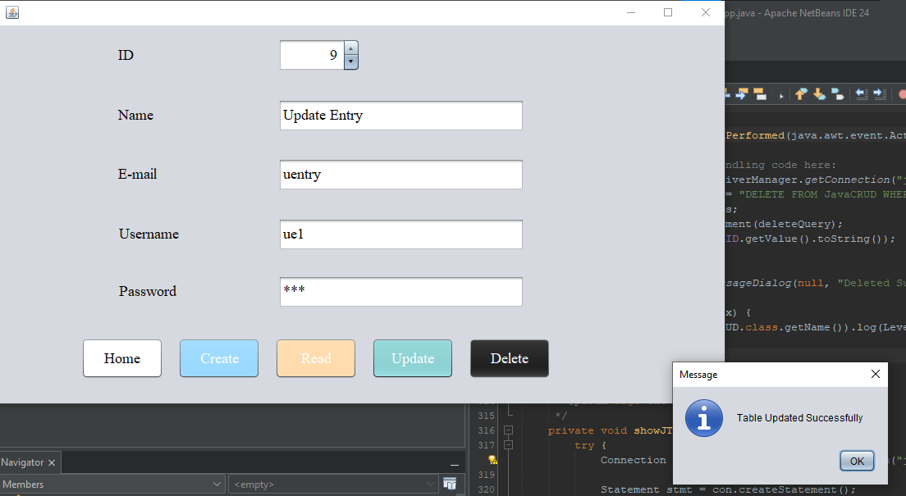
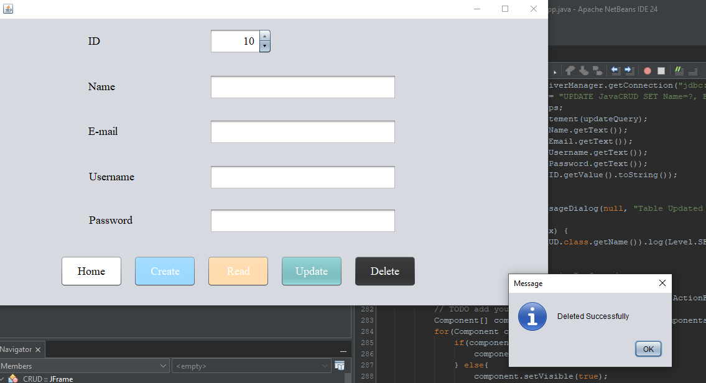

# JDBC CRUD Java  

Welcome to the **JDBC CRUD Java** repository! This project demonstrates a simple Java application to perform **CRUD operations** (Create, Read, Update, Delete) using JDBC. It includes code and resources to help you understand and implement basic CRUD functionality in Java with a database connection.  

Whether you're a beginner or refreshing your Java and database skills, this repository will guide you in mastering JDBC concepts.

---

## Table of Contents  

1. [Code Overview](#code-overview)  
2. [Directory Structure](#directory-structure)
3. [Tools and Technologies](#Tools-and-Technologies)
4. [Breakdown](#breakdown)  
5. [License](#license)  
6. [Conclusion](#conclusion)  

---

## Code Overview  

This project covers the implementation of CRUD operations using **JDBC (Java Database Connectivity)**. It provides examples and templates to help you:  

- Establish a connection with a database.  
- Execute SQL queries to create, retrieve, update, and delete records.  
- Understand the structure and execution flow of JDBC code in Java.  

---

### Multimedia Overview  

#### Video Overview  
https://github.com/user-attachments/assets/17bacf8e-5f5f-476e-9685-d66c416fffa4


#### Images from the CRUD  
Here are some screenshots from the App:

**1. Screenshot 1**  


**2. Screenshot 2**  


**3. Screenshot 3**  


**4. Screenshot 4**  


**5. Screenshot 5**  


---

### Key Concepts Covered  

- Setting up `JDBC Drivers` and Connection Strings.  
- Writing `SQL queries` for `CRUD operations`.  
- Handling exceptions and errors in database operations.  
- Structuring Java code for clean and modular `JDBC implementation`.  

By the end of this project, you will be able to:  

- Build Java applications that connect to a database.  
- Write efficient and secure code for data manipulation.  
- Handle database exceptions and optimize query execution.  

---

## Directory Structure  

Here’s how the repository is organized:  

```plaintext
jdbc-CRUD-Java/
|
├── CRUD.form              # GUI form for CRUD operations
├── CRUD.java              # Core Java file with CRUD logic
├── CRUDAppJava.java       # Main application entry point
├── LICENSE                # License for the project
├── README.md              # Project documentation
```

---

## Tools and Technologies  

This project was developed and tested using the following tools:  

- **XAMPP**: For running the MySQL server and Apache server.  
- **MySQL**: To store and manage application data.  
- **phpMyAdmin**: A GUI for managing MySQL databases.  
- **Apache NetBeans**: IDE used for Java development and debugging.  

---

## Breakdown  

This repository is structured to make it easy to follow and implement `CRUD` operations in Java using `JDBC`. Here’s a breakdown of the files:  

- **CRUD.form**: A visual representation or `GUI design` of the application, if applicable.  
- **CRUD.java**: Contains methods for `CREATE`, `READ`, `UPDATE`, and `DELETE` database records.  
- **CRUDAppJava.java**: Integrates the `CRUD method` and acts as the program’s main execution point.  

---

## License  

This project is open-source and distributed under the **MIT License**. See the [LICENSE](LICENSE) file for more details.  

---

## Conclusion  

Thank you for exploring the **JDBC CRUD Java** repository! Whether you're new to `JDBC` or need a quick refresher, this repository provides a practical way to learn and implement `CRUD operations in Java`.  

Happy coding! 👨‍💻👩‍💻  

**Author**: Divyam Lathiya  
